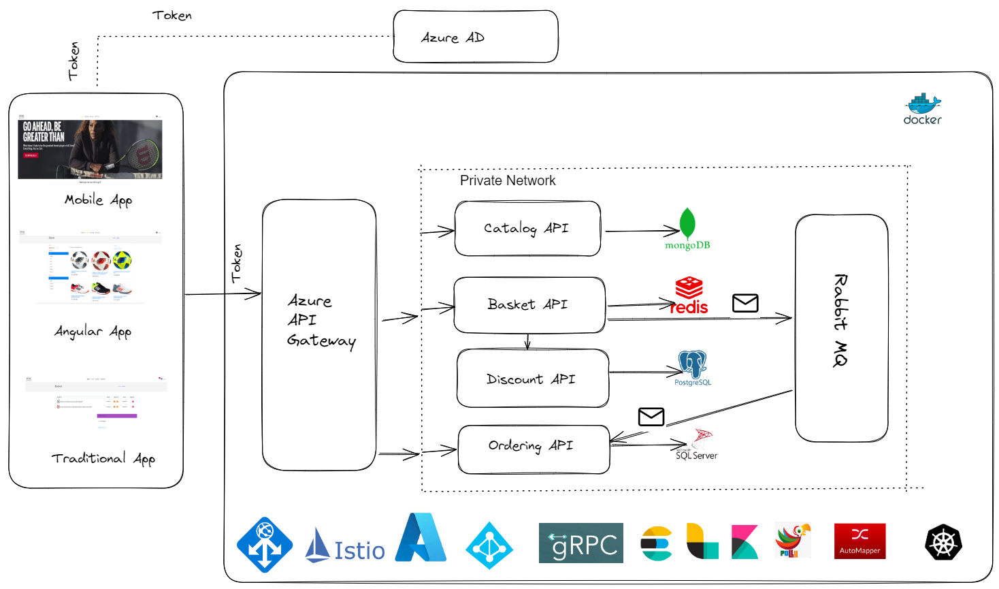

## ECommerce Web App with Dot Net-8 and Angular-18.

The architecture of this project will be similar to the below image.

 ## Architecture
 We use clean architecture with CQRS pattern. For more info visit this [link](https://www.c-sharpcorner.com/article/using-the-cqrs-pattern-in-c-sharp/).
This is a repository where I document everything regarding this project. I'm developing this project based on Microservice architecture.
You will find individual documentation for every service.
